# [Tansoftware](https://www.tansoftware.com) - Domain Driven Design [](https://raw.githubusercontent.com/gosquared/flags/master/flags/flags/shiny/24/France.png)

## Table des matières

- [Introduction](#introduction)
- [Modélisation du domaine](#modélisation-du-domaine)
- [Ubiquitous Language](#ubiquitous-language)
- [Bounded Contexts](#bounded-contexts)
- [Entités, Valeurs et Agrégats](#entités-valeurs-et-agrégats)
- [Repositories et Domain Services](#repositories-et-domain-services)
- [Application Services et CQRS](#application-services-et-cqrs)
- [Événements de domaine et Event Sourcing](#événements-de-domaine-et-event-sourcing)
- [Anti Corruption Layer](#anti-corruption-layer)
- [Specification Pattern](#specification-pattern)
###
- [Prochaine étape : Clean Architecture](https://github.com/Tan-Software/clean-architecture-hexagonale)


## Introduction

Chez [Tansoftware](https://www.tansoftware.com), le [Domain-Driven Design](https://www.fnac.com/a5374870/Vaughn-Vernon-Implementing-Domain-Driven-Design) fait partie intégrante du processus de réalisation de nos applications.    

Le DDD est une méthode de conception de logiciels qui se concentre sur la modélisation des concepts et des règles métier du domaine, en mettant l'accent sur les interactions et les processus métier. 

Cette approche est particulièrement adaptée aux applications complexes et évolutives. 

Nous vous proposons une explication des concepts clés du DDD ainsi que des conseils pour mettre en œuvre cette approche dans vos projets.

[🔝 Retour en haut de page](#table-des-matières)

## Modélisation du domaine

La modélisation du domaine est cruciale pour comprendre et représenter les concepts métier clés.

L'[UML](https://fr.wikipedia.org/wiki/UML_(informatique)) (Unified Modeling Language) est souvent utilisé pour représenter des modèles de conception et d'architecture logicielle, mais il existe d'autres méthodes de modélisation en fonction des besoins de l'équipe et des préférences personnelles. 

Cependant, le choix de la méthode de modélisation dépendra de la facilité de compréhension, de la clarté et de l'efficacité de communication des concepts métier.


### Table des matières de la modélisation du domaine
1. [Comprendre les concepts métier clés](#comprendre-les-concepts-métier-clés)
2. [Identifier les entités, les attributs et les relations](#identifier-les-entités-les-attributs-et-les-relations)
3. [Choisir une méthode de modélisation adaptée](#choisir-une-méthode-de-modélisation-adaptée)
4. [Collaborer avec les experts métier pour valider et affiner le modèle](#collaborer-avec-les-experts-métier-pour-valider-et-affiner-le-modèle)

### 1. Comprendre les concepts métier clés

Avant de commencer la modélisation du domaine, il est essentiel de bien comprendre les concepts métier clés. Cela implique de travailler en étroite collaboration avec les experts métier pour identifier les éléments clés du domaine, les règles métier et les processus.

Les étapes suivantes sont utiles pour comprendre les concepts métier clés :


1. Effectuer des entretiens avec les experts métier
2. Analyser la documentation existante (spécifications, manuels, etc.)
3. Observer les processus métier en action
4. Documenter et valider les concepts métier clés avec les experts métier

#### Mind map pour organiser et visualiser les concepts métier clés d'un domaine bancaire

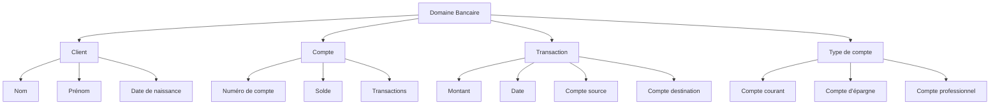
[🔝 Retour à la sous table des matières](#table-des-matières-de-la-modélisation-du-domaine)

### 2. Identifier les entités, les attributs et les relations

Une fois les concepts métier clés compris, l'étape suivante consiste à identifier les entités, les attributs et les relations qui définissent le modèle de domaine. Les entités sont les éléments clés qui représentent les objets du monde réel, les attributs décrivent les propriétés de ces entités et les relations décrivent les interactions entre les entités.

Pour identifier les entités, les attributs et les relations, les étapes suivantes interviennent :

1. Examiner les concepts métier clés pour identifier les entités principales
2. Listez les attributs de chaque entité et déterminez leurs types de données
3. Identifiez les relations entre les entités, y compris les cardinalités (par exemple, 1:1, 1:n, n:m)
4. Vérifiez et validez les entités, les attributs et les relations avec les experts métier

#### Prenons l'exemple d'un domaine bancaire pour illustrer ce processus


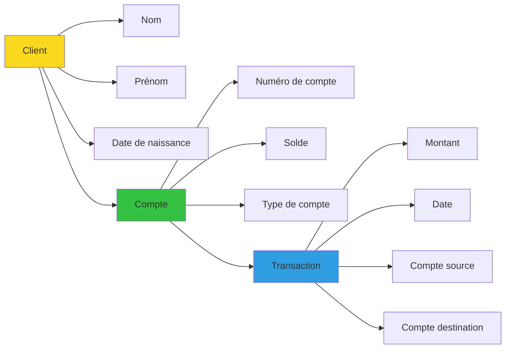
[🔝 Retour à la sous table des matières](#table-des-matières-de-la-modélisation-du-domaine)

### 3. Choisir une méthode de modélisation adaptée

Lorsque les entités, les attributs et les relations ont été identifiés, il est important de choisir une méthode de modélisation adaptée pour représenter le modèle de domaine. La méthode de modélisation doit faciliter la compréhension et la communication des concepts métier.

#### Il existe plusieurs méthodes de modélisation, parmi lesquelles 

1. UML (Unified Modeling Language) : UML est un langage de modélisation visuel largement utilisé pour représenter les modèles de conception et d'architecture logicielle. UML propose différents types de diagrammes, tels que les diagrammes de classe, les diagrammes d'objets, les diagrammes de cas d'utilisation et les diagrammes de séquence, pour représenter différentes facettes d'un système.

	1.1 : Exemple d'outils
	- [ArgoUML](http://argouml.tigris.org/)
	- [StarUML](https://staruml.io/)
	- [UMLNet](https://www.umlet.com/)
	- [PlantUML](https://plantuml.com/)

3. Diagrammes de flux : Les diagrammes de flux sont utiles pour représenter les processus métier et les interactions entre les entités dans un système. Ils montrent les flux de données, les étapes du processus et les points de décision.

	2.1 : Exemple d'outils
	- [Draw.io](https://app.diagrams.net/)
	- [yEd Graph Editor](https://www.yworks.com/products/yed)
	- [Dia](https://sourceforge.net/projects/dia-installer/)
	- [Mermaid](https://mermaid-js.github.io/mermaid/)
	- [PlantUML](https://plantuml.com/)
4. Mind maps : Les mind maps sont des diagrammes qui organisent et visualisent les concepts, les idées et les relations de manière hiérarchique. Ils sont utiles pour représenter les concepts métier clés et leurs relations de manière simple et claire.

	3.1 : Exemple d'outils
	- [FreeMind](https://sourceforge.net/projects/freemind/)
	- [XMind](https://www.xmind.net/)
	- [MindMup](https://www.mindmup.com/)
	- [Freeplane](https://www.freeplane.org/)
	- [Coggle](https://coggle.it/)

#### Voici un exemple de diagramme de classe UML pour représenter les entités, les attributs et les relations du domaine bancaire :

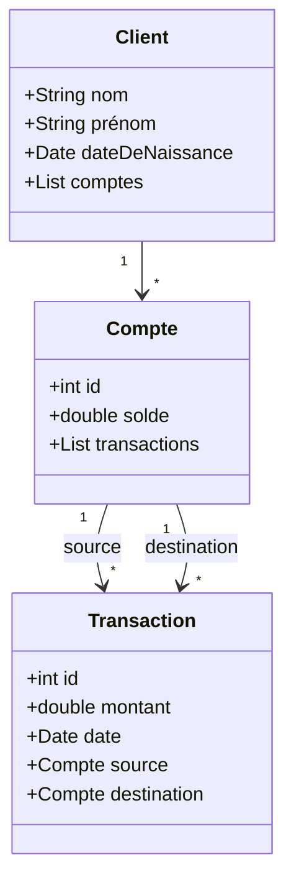

[🔝 Retour à la sous table des matières](#table-des-matières-de-la-modélisation-du-domaine)

### 4. Collaborer avec les experts métier pour valider et affiner le modèle

La collaboration avec les experts métier est cruciale pour valider et affiner le modèle de domaine. Les experts métier possèdent des connaissances approfondies des processus, des règles et des exigences du domaine. 

Leur contribution permet d'assurer que le modèle de domaine est correct, complet et reflète fidèlement la réalité du métier.

Voici quelques conseils pour collaborer avec les experts métier dans le processus de modélisation du domaine :

1. **Organiser des ateliers et des réunions** : Planifiez des ateliers et des réunions régulières avec les experts métier pour discuter du modèle de domaine, présenter les avancées et recueillir leurs commentaires.
2. **Utiliser une langue ubiquitaire** : Assurez-vous que les termes et les concepts utilisés dans le modèle de domaine sont compréhensibles et acceptés par les experts métier. Utilisez la même terminologie que celle employée par les experts métier pour faciliter la communication et la compréhension mutuelle.
3. **Présenter le modèle de domaine de manière visuelle** : Utilisez des diagrammes et des représentations visuelles pour présenter le modèle de domaine aux experts métier. Les diagrammes facilitent la compréhension des concepts et des relations et permettent aux experts métier de valider rapidement l'exactitude du modèle.
4. **Itérer et affiner le modèle** : À mesure que vous collaborez avec les experts métier, ajustez et affinez le modèle de domaine en fonction de leurs commentaires et de leurs suggestions. Cela garantira que le modèle évolue en fonction des besoins du métier et qu'il reste pertinent et à jour.

#### Exemple de diagramme de séquence UML pour illustrer un processus métier de transfert d'argent entre deux comptes bancaires

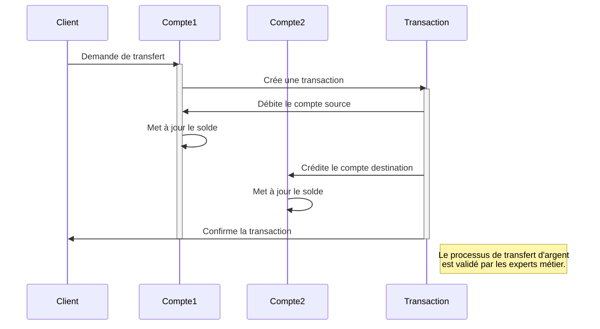
[🔝 Retour en haut de page](#table-des-matières)


## Ubiquitous Language

L'un des principes clés de DDD est l'utilisation d'un [langage ubiquitaire](https://www.linkedin.com/posts/tanguy-chenier_tansoftware-web-ddd-activity-7006869488860020736-OsOz?utm_source=share&utm_medium=member_desktop) (ou langue partagée) pour décrire le domaine. Le langage ubiquitaire est un langage commun qui est partagé par tous les membres de l'équipe de développement, y compris les experts métier, les développeurs et les testeurs.

### Table des matières du langage ubiquitaire
1. [Comprendre l'importance du langage ubiquitaire](#comprendre-limportance-du-langage-ubiquitaire)
2. [Utiliser le langage ubiquitaire](#utiliser-le-langage-ubiquitaire)
3. [Éviter les termes techniques](#éviter-les-termes-techniques)

### 1. Comprendre l'importance du langage ubiquitaire
Le langage ubiquitaire permet une communication claire et précise entre les différents membres de l'équipe de développement. En utilisant un langage commun, les experts métier peuvent transmettre leur connaissance du domaine aux développeurs, qui peuvent à leur tour créer un modèle précis et fidèle de ce domaine.

Un langage commun permet également de réduire les malentendus et les erreurs de communication. Il facilite la collaboration entre les membres de l'équipe et permet à chacun de mieux comprendre les besoins et les objectifs de l'entreprise.

#### Le diagramme suivant illustre comment le langage ubiquitaire peut faciliter la communication entre les membres de l'équipe de développement :

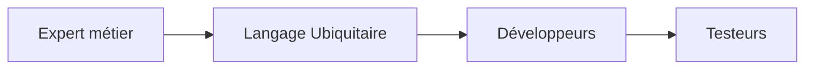
[🔝 Retour à la sous table des matières](#table-des-matières-du-langage-ubiquitaire)

### 2. Utiliser le langage ubiquitaire
Pour utiliser le langage ubiquitaire, il est commun de créer un glossaire qui contient les termes clés et leur définitions. Ce glossaire doit être partagé par tous les membres de l'équipe et doit être mis à jour régulièrement au fil du développement du projet.

Tenir compte des différents points de vue des membres de l'équipe est également essentiel. Les développeurs, les testeurs et les experts métier ont des perspectives différentes sur le projet et les mettre en synergie favorise une bonne compréhension et met en évidence d'éventuelles failles.

#### Le diagramme suivant illustre comment les différents membres de l'équipe peuvent contribuer à l'utilisation du langage ubiquitaire :

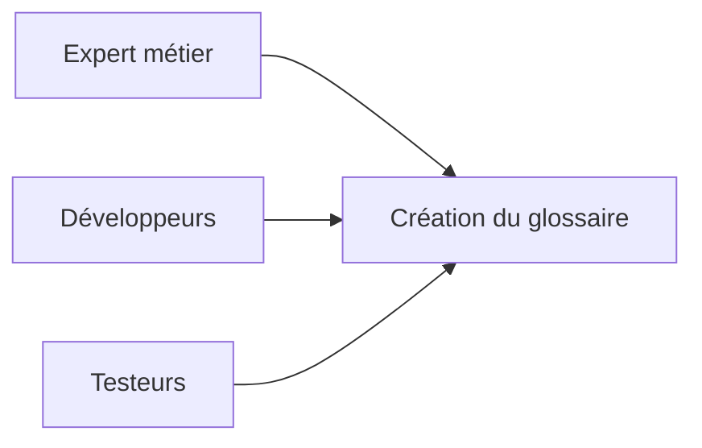

[🔝 Retour à la sous table des matières](#table-des-matières-du-langage-ubiquitaire)


### 3. Éviter les termes techniques
Lors de l'utilisation du langage ubiquitaire, il convient d'eviter les termes techniques qui peuvent être mal compris par les membres de l'équipe, notamment lorsqu'ils ne sont pas familiers avec ces ceux-ci. 
Aussi, il est préférable d'utiliser des mots clairs et simples, compris par tous.

De même, il convient dans toute l'application de rester cohérent dans l'utilisation du langage ubiquitaire, afin d'éviter les confusions et les erreurs de communication.

#### Exemple

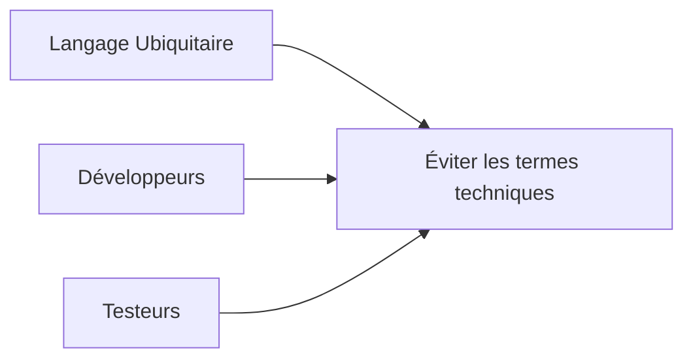

[🔝 Retour en haut de page](#table-des-matières)

## Bounded Contexts
Un Bounded Context (contexte délimité en français) est une **frontière logique dans le modèle de domaine** où un **langage partagé** est utilisé pour communiquer entre les membres de l'équipe.

Lorsqu'un domaine est complexe et vaste, il est souvent nécessaire de le diviser en plusieurs Bounded Contexts. Chaque contexte doit être autonome et posséder son propre langage partagé.

L'utilisation de Bounded Contexts permet de mieux organiser le code, de faciliter la compréhension du modèle de domaine et de permettre une collaboration plus efficace entre les membres de l'équipe. 

En outre, cela peut aider à résoudre des problèmes de communication et de compréhension lorsqu'il y a des concepts similaires qui sont utilisés de manière différente dans différentes parties du domaine.

### Le diagramme suivant illustre un exemple de Bounded Contexts pour une application bancaire

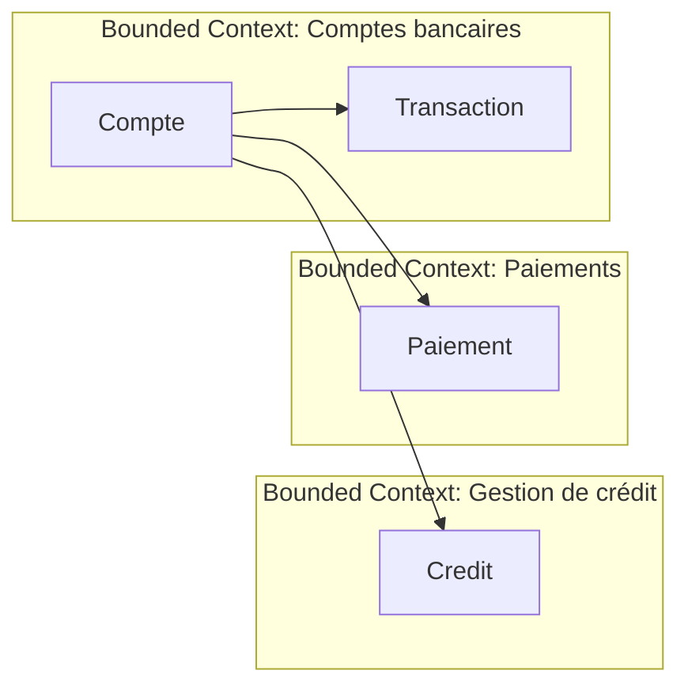

1. [Identifier les Bounded Contexts](#identifier-les-bounded-contexts)
2. [Délimiter les limites du Bounded Context](#délimiter-les-limites-du-bounded-context)
3. [Créer un diagramme de contexte](#créer-un-diagramme-de-contexte)

### Identifier les Bounded Contexts
Pour identifier les Bounded Contexts dans un domaine, il est recommandé de travailler en étroite collaboration avec les experts métier afin de comprendre les différentes parties et les limites du domaine. Une des façons de commencer est de créer une carte mentale ou un diagramme de haut niveau du domaine pour visualiser les différentes parties.

Penser DDD ou Bounded Contexts ne veut pas dire penser la modélisation de la base de données ou autres éléments de ce type en tant que tels, mais les interactions que ces éléments vont requérir, afin qu'ils restent un détail d'implémentation.
Par exemple, la base de données est un élément pouvant être mis en place plus tard dans la réalisation de l'application, si une interface pertinente la simule. Le but est de les borner dans un contexte afin de les isoler, favoriser leur maintenabilité et leur évolutivité.

Ainsi, il convient ensuite d'examiner les interactions entre les différentes parties pour déterminer où les limites des Bounded Contexts devraient se situer. Cela implique de comprendre les différents processus métier et les flux de données dans le domaine.

Une autre approche est d'utiliser des méthodes de [design thinking](https://fr.wikipedia.org/wiki/Design_thinking) pour identifier les besoins et les points de douleur des utilisateurs du système. Cela peut aider à identifier les différents cas d'utilisation et les fonctionnalités qui pourraient être regroupés en Bounded Contexts.

Enfin, il est important de considérer les contraintes techniques et les aspects de la mise en œuvre lors de la définition des Bounded Contexts. 
Ce qui signifie que chaque contexte doit être autonome et isolé des autres, tout en permettant également de communiquer avec les autres contextes au besoin.

#### Une application de e-commerce peut ainsi ressembler à ceci

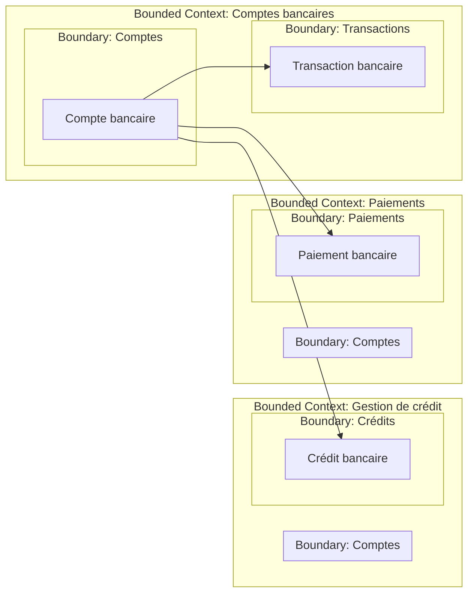

### Délimiter les limites du Bounded Context
Une fois que les Bounded Contexts ont été identifiés, il convient de délimiter précisément leurs frontières afin d'éviter tout chevauchement ou confusion entre eux.

Afin de mettre des frontières à un Bounded Context, il est utile de se poser les questions suivantes :

- Quels sont les acteurs impliqués dans ce contexte ?
- Quels sont les processus métier impliqués dans ce contexte ?
- Quelles sont les entités et les objets de valeur impliqués dans ce contexte ?
- Quelles sont les règles métier et les contraintes qui s'appliquent dans ce contexte ?

Une fois ces questions répondues, il est possible de définir des interfaces claires entre les différents Bounded Contexts pour permettre une communication fluide et précise entre eux.

Cependant, ces limites ne sont pas figées et peuvent évoluer au fil du temps en fonction des besoins et des évolutions du domaine. 

Enfin, il est essentiel de documenter ou d'avoir un process permettant à tous le monde de savoir immédiatement les changements opérés, pour assurer une compréhension commune du modèle de domaine.

#### Exemple de mise en place de fontières de deux Bounded Contexts

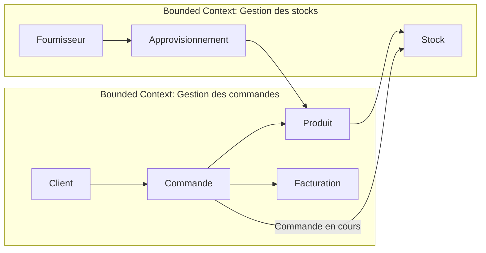

### Créer un diagramme de contexte
Un diagramme de contexte est un outil utile pour visualiser les Bounded Contexts et leur relation avec d'autres systèmes externes. Il montre comment les différents contextes interagissent avec les systèmes externes et les autres contextes.

Le diagramme de contexte montre également les interfaces utilisées pour communiquer entre les différents contextes et les systèmes externes. 

Aussi, chaque interface se doit d'être claire avec un langage partagé et des limites définies intelligiblement.

#### Exemple pour une application de commerce électronique

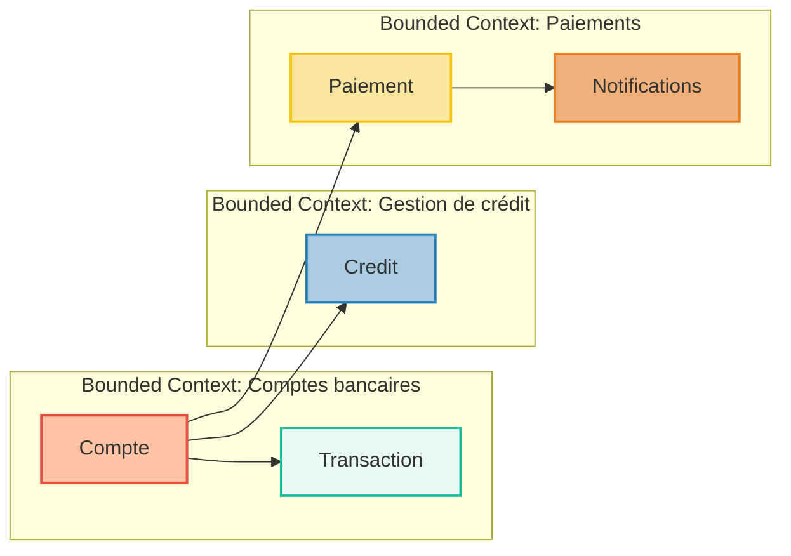

[🔝 Retour en haut de page](#table-des-matières)


## Entités, Valeurs et Agrégats 

Les Entités, Valeurs et Agrégats sont des concepts clés de DDD qui permettent de modéliser et de structurer le domaine d'une application.

### Entités  
- Les Entités représentent les objets du domaine qui ont une identité unique et qui peuvent être suivis à travers le temps. 
- Elles ont des attributs qui peuvent être modifiés au fil du temps tout en préservant leur identité. 
- Exemple d'Entité : un compte utilisateur dans une application bancaire. 

### Diagramme d'Entité 

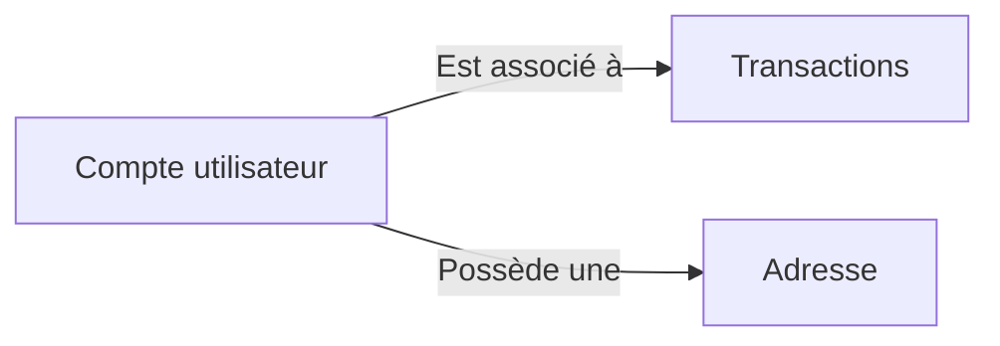

### Valeurs
-   Les Valeurs représentent les objets du domaine qui n'ont pas d'identité unique et qui sont définis par leurs attributs.
-   Elles ne peuvent pas être modifiées et doivent être remplacées lorsqu'une modification est nécessaire.
-   Exemple de Valeur : une adresse postale dans une application de livraison.

### Diagramme de Valeur

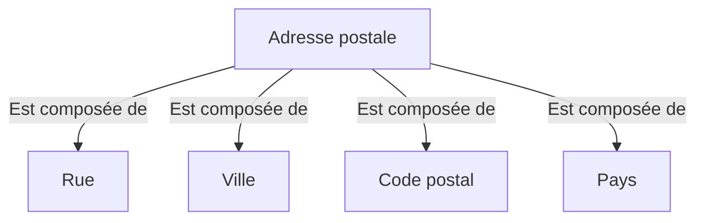

### Agrégats

-   Les Agrégats sont des groupes d'Entités et/ou de Valeurs qui ont une signification sémantique cohérente dans le modèle de domaine.
-   Ils ont une racine d'agrégat qui est l'Entité ou la Valeur qui représente l'ensemble de l'Agrégat.
-   Exemple d'Agrégat : une commande dans une application de commerce électronique.

### Diagramme d'Agrégat

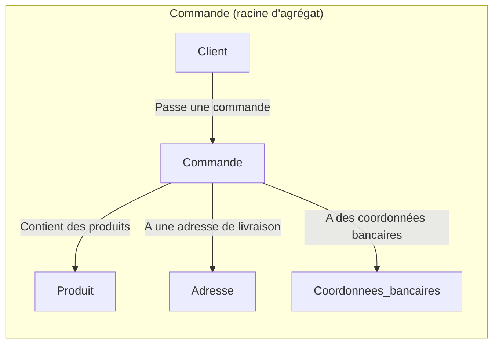

[🔝 Retour en haut de page](#table-des-matières)

## Repositories et Domain Services

Les Repositories et Domain Services sont des composants essentiels dans la mise en œuvre de DDD. Ils permettent de gérer l'accès aux données et de fournir des opérations spécifiques au domaine.

### Repositories
- Les Repositories sont des mécanismes qui permettent de stocker, récupérer et manipuler les instances d'Entités et d'Agrégats.
- Ils fournissent une abstraction pour l'accès aux données, ce qui permet de séparer la logique métier de la logique d'accès aux données.
- Les Repositories doivent être conçus pour gérer les opérations de base telles que l'ajout, la suppression, la mise à jour et la récupération d'Entités et d'Agrégats.

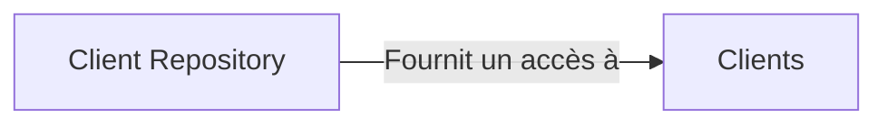

### Exemple de Repository (OrderRepository) sous Symfony

1. Créez une interface `OrderRepositoryInterface` pour définir les opérations requises par le Repository :

```php
<?php
// src/Domain/Repository/OrderRepositoryInterface.php

namespace App\Domain\Repository;

use App\Domain\Model\Order;

interface OrderRepositoryInterface
{
    public function find(int $id): ?Order;
    public function save(Order $order): void;
}
```

2.  Implémentez l'interface `OrderRepositoryInterface` avec une classe `OrderRepository` qui utilise Doctrine ORM :
```php
<?php
// src/Infrastructure/Repository/OrderRepository.php

namespace App\Infrastructure\Repository;

use App\Domain\Model\Order;
use App\Domain\Repository\OrderRepositoryInterface;
use Doctrine\Bundle\DoctrineBundle\Repository\ServiceEntityRepository;
use Doctrine\Persistence\ManagerRegistry;

class OrderRepository extends ServiceEntityRepository implements OrderRepositoryInterface
{
    public function __construct(ManagerRegistry $registry)
    {
        parent::__construct($registry, Order::class);
    }

    public function find(int $id): ?Order
    {
        return parent::find($id);
    }

    public function save(Order $order): void
    {
        $this->_em->persist($order);
        $this->_em->flush();
    }
}
```

### Domain Services

Les Domain Services sont des services qui contiennent la logique métier spécifique qui ne peut pas être incluse dans les Entités ou les Agrégats.

Ils sont utilisés pour orchestrer les interactions entre différentes parties du domaine, telles que les Entités, les Agrégats et les Repositories.

Les Domain Services peuvent être conçus pour gérer des opérations complexes qui impliquent plusieurs Entités ou Agrégats, ou pour fournir des services spécifiques au domaine, tels que la validation, les calculs et les transformations.

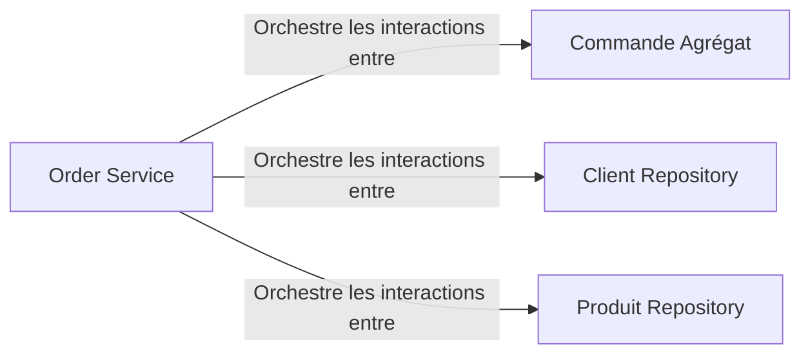

### Exemple de Domain Service (OrderService) sous Symfony

1.  Créez une classe `OrderService` qui contient la logique métier pour gérer les commandes :
```php
<?php
// src/Domain/Service/OrderService.php

namespace App\Domain\Service;

use App\Domain\Model\Order;
use App\Domain\Repository\OrderRepositoryInterface;
use App\Domain\Repository\ProductRepositoryInterface;

class OrderService
{
    private $orderRepository;
    private $productRepository;

    public function __construct(
        OrderRepositoryInterface $orderRepository,
        ProductRepositoryInterface $productRepository
    ) {
        $this->orderRepository = $orderRepository;
        $this->productRepository = $productRepository;
    }

    public function createOrder(int $customerId, array $productIds): Order
    {
        $order = new Order($customerId);

        foreach ($productIds as $productId) {
            $product = $this->productRepository->find($productId);
            if ($product) {
                $order->addProduct($product);
            }
        }

        $this->orderRepository->save($order);

        return $order;
    }
}

```

[🔝 Retour en haut de page](#table-des-matières)


## Application Services et CQRS

Les Application Services et le modèle CQRS (Command Query Responsibility Segregation) sont des concepts importants dans la mise en œuvre du DDD pour la gestion des interactions entre la couche applicative et la couche domaine.


### Application Services

Les Application Services jouent un rôle central dans l'architecture DDD en coordonnant les interactions entre la couche de présentation (contrôleurs, vues, etc.) et la couche de domaine (Entités, Agrégats, Domain Services, etc.). Ils sont responsables de l'orchestration des actions métier et de la coordination des interactions entre les composants du domaine. Voici quelques points clés pour mieux comprendre les Application Services :

-   Ils fournissent une interface simplifiée pour la couche de présentation, en encapsulant la complexité de la logique métier à l'intérieur du domaine.
-   Les Application Services sont responsables de la gestion des transactions et de la persistance des données, en déléguant ces opérations aux Repositories appropriés.
-   Ils peuvent également utiliser des Domain Services pour effectuer des opérations complexes impliquant plusieurs Entités ou Agrégats.
-   Les Application Services sont généralement conçus pour traiter des cas d'utilisation spécifiques de l'application, tels que la création d'une commande, la gestion des utilisateurs, etc.
-   Ils ne doivent pas contenir de logique métier, qui doit être placée dans les Entités, les Agrégats ou les Domain Services.

#### Diagramme montrant le rôle des Application Services dans une architecture DDD

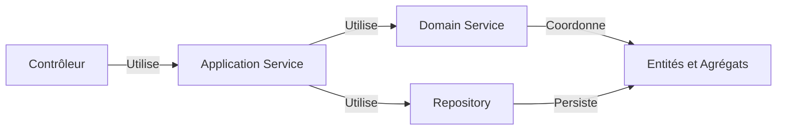

### CQRS

Le [CQRS](https://www.linkedin.com/posts/tanguy-chenier_tansoftware-cqrs-logiciels-activity-7007146015493357568-XdGY?utm_source=share&utm_medium=member_desktop) est un modèle d'architecture qui sépare les responsabilités de lecture et d'écriture dans une application en deux parties distinctes :

-   Les **Commandes** (Commands) : représentent les actions d'écriture et de modification des données.
-   Les **Requêtes** (Queries) : représentent les actions de lecture et de récupération des données.

Les avantages de l'utilisation de CQRS dans une architecture DDD incluent :

-   Une séparation claire des responsabilités, ce qui facilite la maintenance et l'évolutivité.
-   Des performances améliorées, car les opérations de lecture et d'écriture peuvent être optimisées séparément.
-   Une meilleure flexibilité pour adapter l'architecture à des besoins spécifiques, tels que des contraintes de performance, de sécurité ou de cohérence des données.

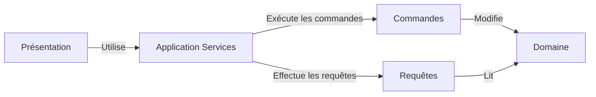

[🔝 Retour en haut de page](#table-des-matières)

## Événements de domaine et Event Sourcing

Les événements de domaine et l'Event Sourcing sont des concepts liés à la gestion des changements d'état dans une application en utilisant le Domain Driven Design (DDD).

### Événements de domaine

Les événements de domaine représentent des actions ou des changements d'état importants qui se produisent dans le système. Ils sont émis par les Entités et les Agrégats lorsqu'un changement d'état significatif se produit, et ils fournissent un moyen de réagir à ces changements de manière décentralisée.

Quelques caractéristiques des événements de domaine :

-   Ils sont [immuables](https://fr.wikipedia.org/wiki/Objet_immuable) et contiennent des informations sur un changement d'état spécifique.
-   Ils sont émis par les Entités ou les Agrégats en réponse à une action ou à un changement d'état.
-   Ils peuvent être consommés par d'autres composants du système, tels que les Application Services, les Domain Services, ou d'autres Entités et Agrégats.
-   Ils permettent une communication décentralisée et asynchrone entre les composants du système.

### Event Sourcing

L'Event Sourcing est un modèle de persistance basé sur les événements de domaine. Au lieu de stocker l'état actuel d'une Entité ou d'un Agrégat, l'Event Sourcing stocke la séquence d'événements qui ont conduit à cet état. L'état actuel de l'Entité ou de l'Agrégat peut être reconstruit en rejouant la séquence d'événements.

Quelques avantages de l'Event Sourcing :

-   Il fournit un historique complet des changements d'état, ce qui peut être utilisé pour l'audit, le débogage ou la génération de rapports.
-   Il facilite la mise en œuvre d'opérations complexes telles que le retour en arrière, la réplication ou la réparation des données.
-   Il permet une meilleure séparation des préoccupations entre la logique métier et la persistance des données.
-   Il peut améliorer les performances en permettant des opérations de lecture et d'écriture optimisées et décentralisées.

#### Diagramme montrant les événements de domaine et l'Event Sourcing dans une architecture DDD

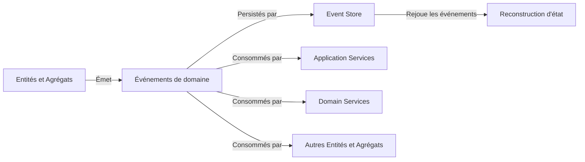

[🔝 Retour en haut de page](#table-des-matières)

### Anti-Corruption Layer
Un Anti-Corruption Layer (ACL) est une couche qui sert de barrière entre différents contextes limités (Bounded Contexts) pour éviter la propagation de modèles et de concepts incorrects d'un contexte à l'autre. L'ACL traduit les communications entre les contextes de manière à ce qu'ils restent indépendants et cohérents avec leurs propres modèles de domaine.

#### Diagramme illustrant un Anti-Corruption Layer (ACL) entre deux Bounded Contexts 

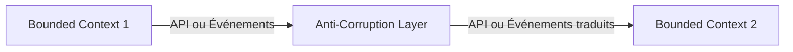

[🔝 Retour en haut de page](#table-des-matières)

### Specification Pattern
Le Specification Pattern est un modèle de conception qui permet d'encapsuler des règles métier spécifiques dans des objets réutilisables. Cela facilite la vérification des règles métier et la construction de requêtes complexes sans avoir à intégrer ces règles dans les Entités, les Agrégats ou les Repositories.

#### Exemple de diagramme montrant l'utilisation du Specification Pattern pour vérifier les règles métier 
```mermaid
graph LR
    A[Entité] -- Vérifie les règles --> B[Specification]
    B -- Utilise --> C[Règle métier 1]
    B -- Utilise --> D[Règle métier 2]
    B -- Utilise --> E[Règle métier 3]
```
[🔝 Retour en haut de page](#table-des-matières)
